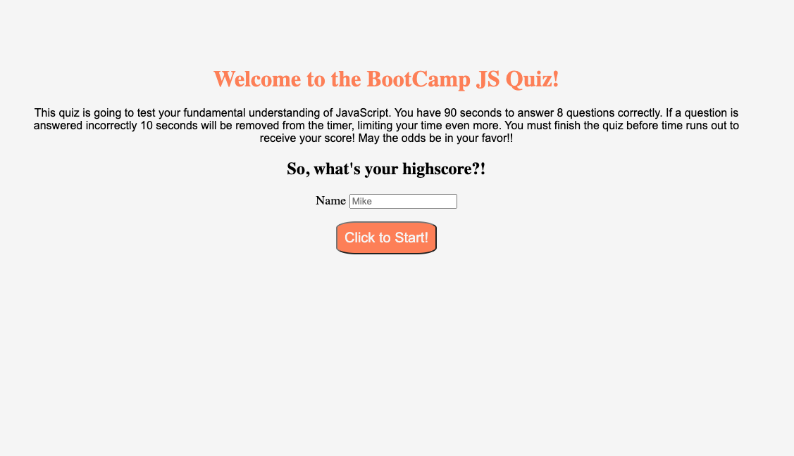
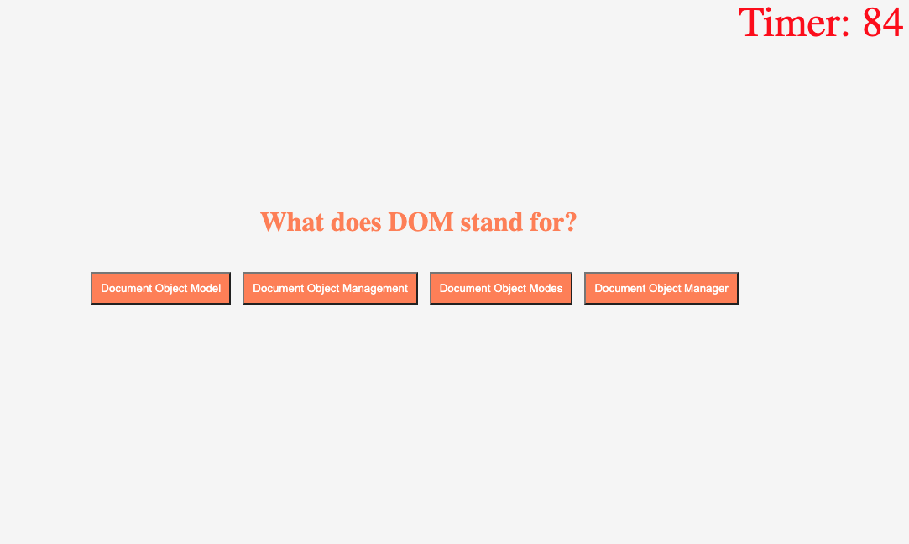
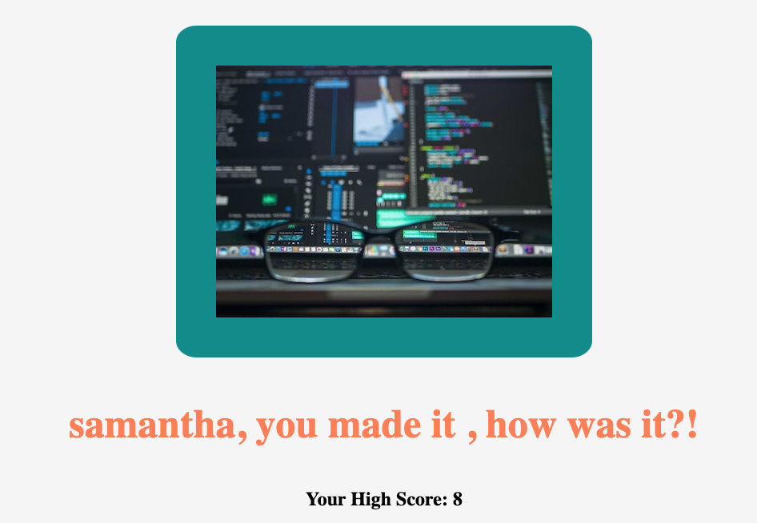

# Project Objective

Link:

The main objective of this project was to demonstrate a majority of the skills I've learned this far in the bootcamp. Combining HTML, CSS, and Javascript to create a multiple-choice quiz that runs in the browser, is a responsive user interface and shows my ability to store and retrieve items out of local storage.

# JavaScript

Figuring out where to start was probably one of the most challenging things to wrap my head around for this project. PSUEDO code was a great place to start, it really helped me outline the pieces I needed to get just the simplest functions to run. I've learned that my preference is to get things to display and function properly before organizing and styling.

My biggest takeaway from this project was that JavaScript means, to me, the order of operations. There were a few times where I couldn't get a function to run, or something wasn't being triggered or display simply because it wasn't where it needed to be to run.

# HTML

It was great to be able to build a handful of the elements with HTML, and grabbing those ID's, classes, etc. and applying data to them. It was a great way to practice pulling the data from HTML and assigning it value's in JavaScript. It was great practice.

# Local Storage

This was probably where most of my time was spent and coincidentally was the last piece I worked on. Understanding where the values are being run in JavaScript and when the best time to store them was something I hadn't thought much about. Again, order of operations. One thing that did challenge me was making sure I was identifying the right key value pairs (making sure my variables were correct).

# Screen Shots

